theme: Next, 1
build-lists: true
autoscale: true

# [fit] U 2 can U2F


---

# Hello!

## Rob N ★

Email: robn@fastmail.com
Twitter: @robn
Github: @robn

<br>

https://robn.io/u2f-lca-2017

^Good morning, welcome, thanks for being here

^My name is Rob.

^There's some places to talk at me. Please do!

^These slides and links to anything I mention here will be at this URL, so don't stress about trying to write anything down

^Time for questions at the end

---

# Two-factor authentication


* Something you know
 * Password
* Something you have
 * SMS (phone)
 * TOTP (phone, standalone)
 * Proprietary/enterprise/corporate things (standalone)

^So here's Bono, with his two factors, to help remind us what 2FA is about

^2FA is where, at login, you present two things to establish your identity

^★ Something you know, that is, your password

^★ Something you have, some physical item that only you have access to, that has been previously associated with your account. That might be something connected to your phone, or some physical object

^The idea is that if someone gets your password, its not useful to them without the second factor.

---

# Two-factor authentication


* Registration
 * Connect a second factor to an existing account
* Authentication
 * Verify that the user has the second factor

^Two separate stages: registration and authentication

^★ At registration a logged-in user connects their second factor to their account

^★ At login, the service confirms that the logged-in user is in possession of the second factor

---

# [fit] Not a<br>live demo


^Let's take a quick look at the two most common methods, SMS and TOTP

^Using FastMail as an example because we didn't build this thing to not show it off

---

# SMS registration

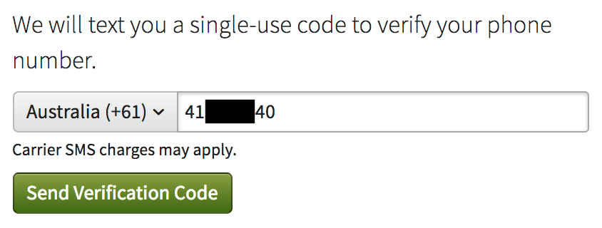

^So SMS registration is simple. You enter your phone number.

---

# SMS registration


^The service sends you a code.

---

# SMS registration

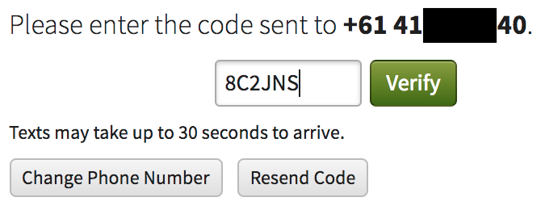

^You enter the code and the service checks it. If you got it right, then we've confirmed the number belongs to you.

---

# SMS authentication

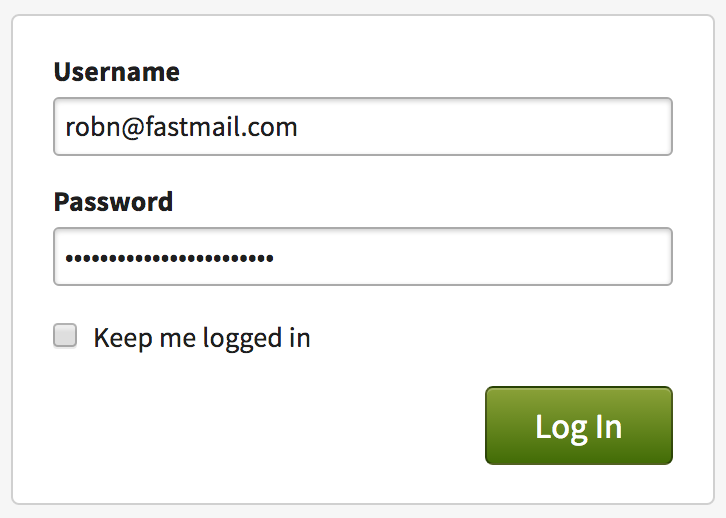

^Then at login, you start in the normal way, with your username and password

---

# SMS authentication

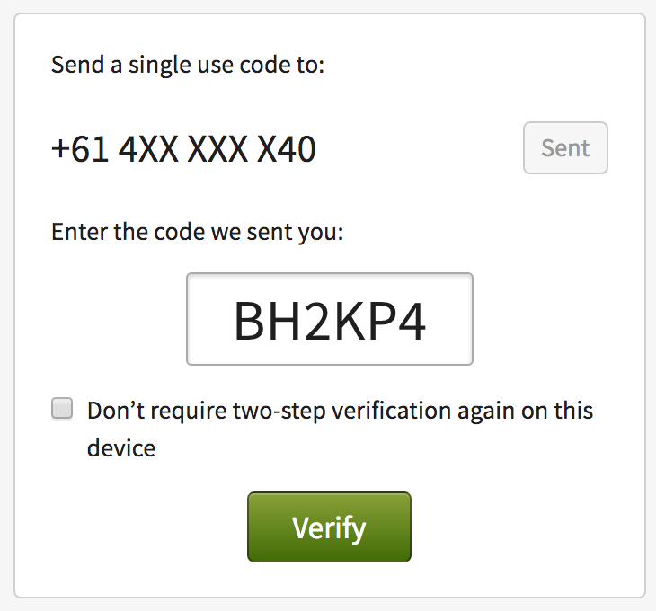

^If you got the password right, the service sends a code to the registered SMS number. You enter it, and if the code matches, we let you in.

^This is a pretty straightforward method. Lots of services do this. You've probably used it before.

---

# TOTP registration

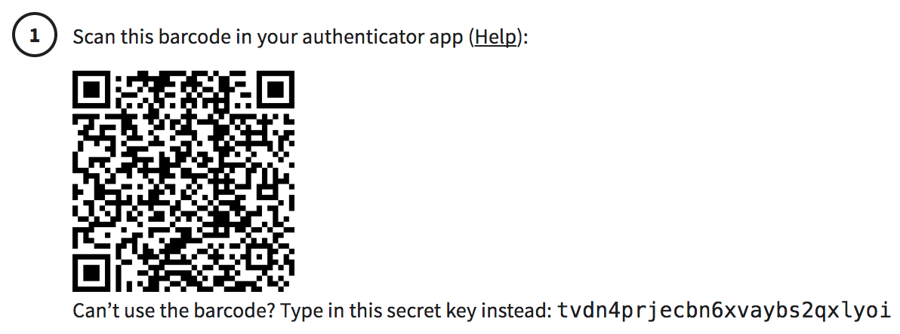

^TOTP is a two-factor method based on a shared key and a synchronised clock

^Service generates a key, and somehow gives it to the user's TOTP client

^Usually that's an app on a phone and you can scan a QR code to set up

^If not, you get to type the key in by hand. That's fun.

---

# TOTP registration


^Once your TOTP app has the key, it combines it with the time to produce a code

^The code is valid for a short time (typically 30 seconds)

^(this is a borrowed screenshot from FreeOTP's homepage; these apps tend to set a "don't allow screenshots" flag and I couldn't be bothered working around it)

---

# TOTP registration

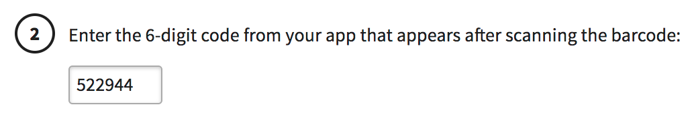

^You enter the code from the app, just to prove you've got it all set up properly.

^And then its all set up

---

# TOTP authentication

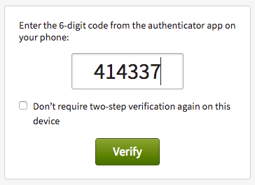

^At login, you enter your username and password

^Then you enter the code from the app. The server uses the key and timestamp to generate a code too, and if they match, you're in

---

# TOTP hardware token

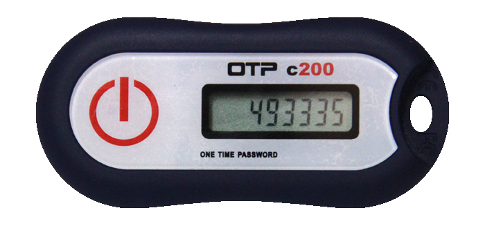

^TOTP hardware tokens also exist

^They come with a pre-programmed key that the vendor will give you when you buy the token. Usually by sending email or on a piece of paper with the device. Yeah.

---

# TOTP hardware token

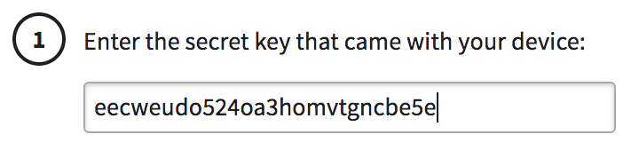

^You type in the key you got from the vendor, and then its all the same. The two sides share a key and can generate the same codes based on the current time

---


^So these all work fine. But they're kind of a mess

---

# [fit] Your<br>second factor<br>is you


^2FA assumes that you are the only one with access to the second factor

^If anyone else has it, then all they need is the password and they've got your account, which puts us right back where we started

---

# [fit] You are<br>not a<br>number


^But your phone number isn't secure. It's fairly straightforward these days for an attacker to intercept messages

^TOTP is safer, but the way most people use it still assumes that your phone is secured and the key can't be leaked

---

# [fit] Phishing


^And all of these methods have some vulnerability to phishing and keyloggers. They're passive devices; the server receives a code but has no way to know where it comes from

^If a middleman can intercept the login process, they can still impersonate you

---

# [fit] Usability

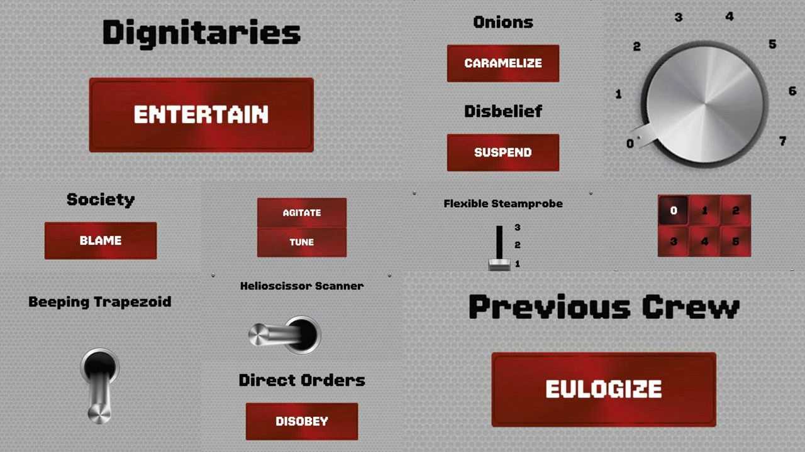

^Also the usability kinda sucks. It all ends up being manually typing strings of characters and hoping you got it right and it hasn't timed out yet

---

# [fit] Universal<br>two-factor


^Universal two-factor, or U2F, solves a lot of these problems

---

# Universal<br>two-factor

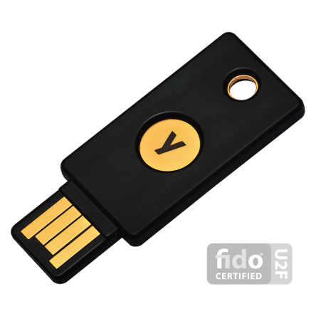

* Open standard for a two-factor device
 * FIDO Alliance
 * Multiple hardware manufacturers
   * USB, NFC or Bluetooth
 * Multiple server and host implementations

^★ U2F is an open standard for a two-factor device

^Its defined by an industry group called the FIDO (Fast IDentity Online) Alliance. All the specs are available to read and implement; there's some rules around trademarks and certifications.

^Hardware available from multiple manufacturers, all interop. Or you can make your own.

^Hardware profiles for USB, NFC and Bluetooth.

^Software implementations for many languages, and not hard to do yourself if you have to (I wrote the Perl library)

---

# Universal<br>two-factor


* Active device
 * Participates directly in authentication process
 * Public key crypto

^★ The main difference between U2F and other things like SMS and TOTP is that its an active device. The browser talks to it directly, so it can do a lot more than just produce a six-digit code.

^Because the device is included in the authentication process, it can do real crypto operations to provide some really nice features


---

# Universal<br>two-factor


* One device, multiple sites
* Phishing protection
* Cloning protection
* Device properties

^★ You can use a single device on multiple accounts, across multiple sites

^★ The protocol has phishing protection built in

^★ There's a way to detect if the device has been cloned

^★ And you can get information about the device itself and its capabilities, so you can set policies based on device type or features

---

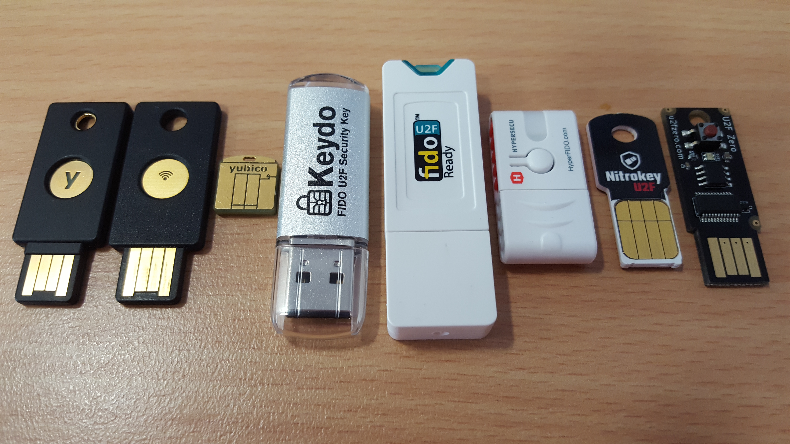

^As I said, there's multiple manufacturers

^This is my "test lab", which is mostly just a box of random devices because I keep buying them

^It's actually kind of boring because they all just work and don't do anything else

^I've got some in my bag if you want to take a look at the different sizes and shapes

---

# [fit] U2F Zero

## [fit] https://u2fzero.com/

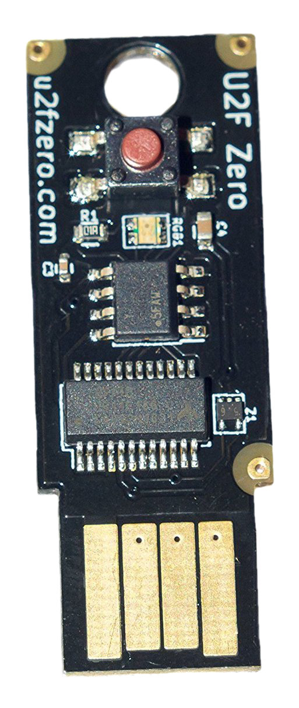

^This one will of particular interest to this audience

^This is a U2F Zero device. It's an open-source design by a guy called Conor Patrick.

^You can go to u2fzero.com and get schematics, board layouts, parts lists, firmware source and instructions to build one yourself

^I'm all thumbs so I haven't attempted this myself; fortunately he did a short production run a few months ago so I grabbed a couple to try out. Last I checked there's still some available on Amazon.

---

# Tomu

## https://tomu.im/

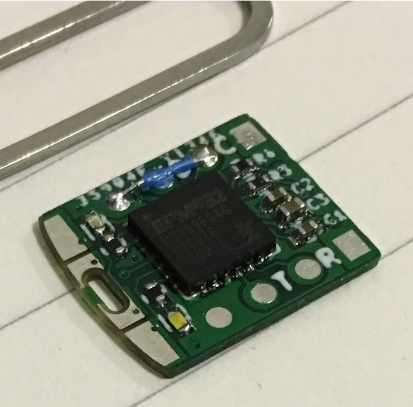

* A tiny computer that fits inside your USB port
 * ARM CPU
 * Two buttons
 * Two LEDs

* Open Hardware Certified

^This is a Tomu

^★ Its a tiny ARM computer that fits inside your USB port

^★ The design is fully open

---

# Tomu

## https://tomu.im/


* Designed by Tim Ansell
* Planned to be a U2F device
* Needs software
* You can help!

^★ This is Tim Ansell. He designed it. He's in the room 👋

^★ The original plan for Tomu is that it would be a U2F device

^★ But its not there yet. The hardware works, but it needs software

^★ And that's where you come in!

^If this sounds like something you might like to help with, go and find Tim. He's got a pile of development units and would love to talk to anyone who wants to help get the software up and running

---

# U2F registration

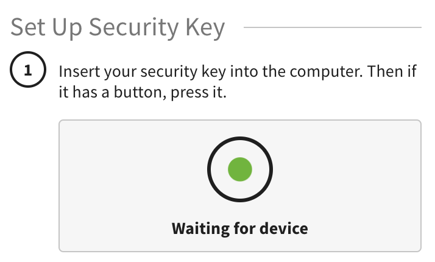

^Once you've got your hardware, setup is trivial. You press the button...

---

# U2F registration

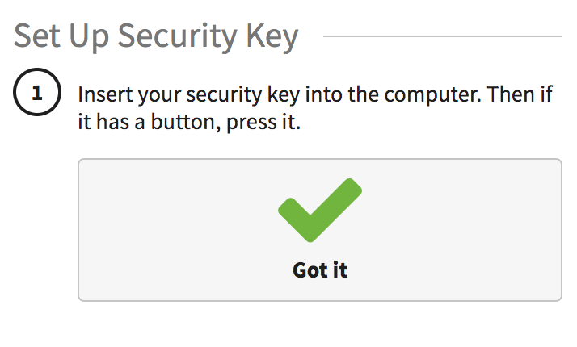

^And its done.

---

# U2F authentication

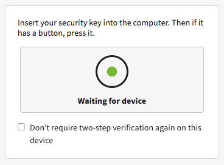

^And at login, same.

---

# U2F authentication

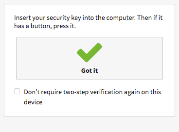

^I'm not exaggerating; its that simple

---


^But under the hood, there's lots happening

^Which made it kind of hard to know how to start explaining it

^You don't actually have to know how most of this works in order to use or implement U2F

^But this is a security conference, so some of you are probably interested in the security properties of these devices. So I'll try!

---

# [fit] Authentication<br>flow


^We'll start with a simplified view of the authentication flow, and then add features until we get to "real" U2F

---

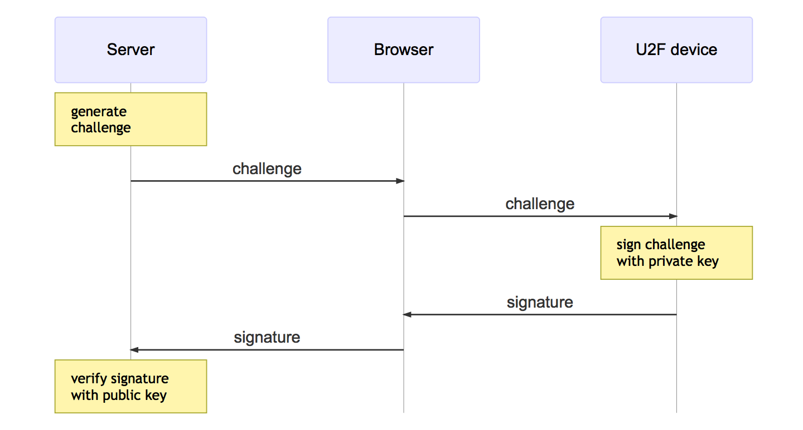

^We assume the device has been registered. The server has the public key; the device has the private key.

^The server generates a challenge. Its just a long random string.

^The server passes the challenge to the browser, which passes it onto the device.

^The device signs it, and returns the signature to the browser, which in turn passes it on to the server.

^The server uses the public key to validate the signature. If it checks out, we've confirmed the user has the proper U2F device, and can log them in.

---

# [fit] Phishing<br>protection


^This is still vulnerable to phishing though

^An active attacker can sit between the user and the target service and pass the challenge and signature through

---

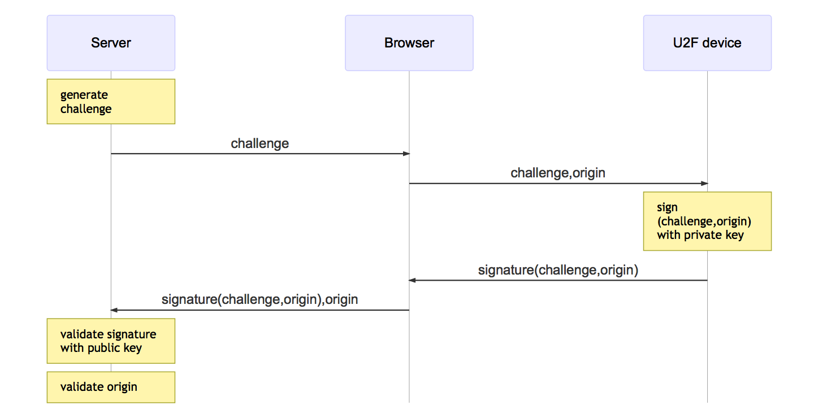

^To protect against this, we get the browser to pass the site origin down to the device for inclusion in the signature

^The device signs the challenge and origin and passes back the signature

^The browser passes the signature back to the server, along with the origin

^The server checks the signature, and can also check the origin. If the signature is valid but the origin isn't valid for the site, then you know there's a middleman involved and you can take action

---

# [fit] Application-<br>specific<br>keys


^We're already doing much better than other 2FA options

^So far though, our device only has one key pair. So if we use our device on multiple accounts, the same public key will be stored on all of them, and the server operator knows they're all the same user.

^Similarly, if the device was used on multiple services, the same public key would be present on all of them, making it possible for a user to be tracked across services

---

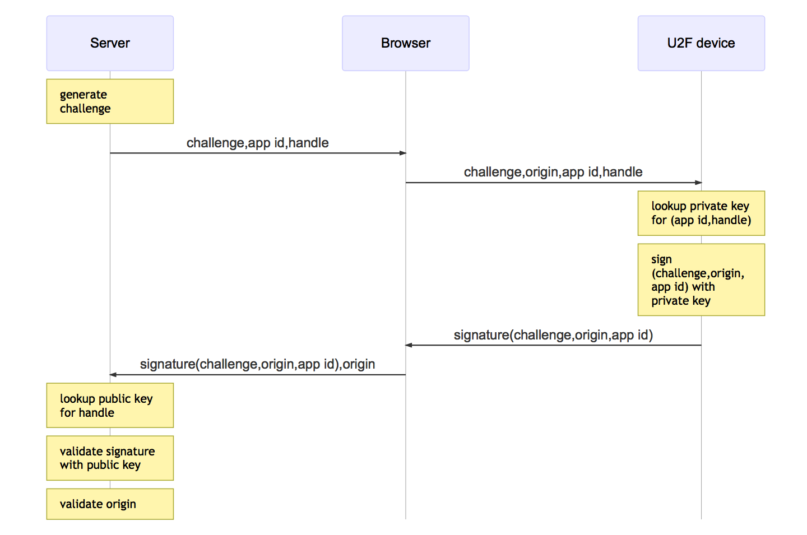

^So we give the device the ability to create keypairs, and give them a name. Both the server and the device contribute part of the name. The server part is the "application id", and the device part is the "handle".

^So now, the server starts by generating a challenge, and sends that to the device with the name of the key it should use to sign it with.

^The browser adds the origin and passes all that along to the device

^The device uses the key name, that is, the app id and handle, to look up the correct private key

^And then the rest proceeds as before. The challenge is signed and returned to the browser, then to the server

^The server looks up the public key, and does its checks

---

# [fit] Cloning<br>protection


^So one possible attack is that you put your device down, someone picks it up, uses some magical method to make a copy of its internal state, and now they've got a working second factor for your account

^This isn't a likely mode of attack for most people, but it is for some, and its nice to know we can do something about it

---

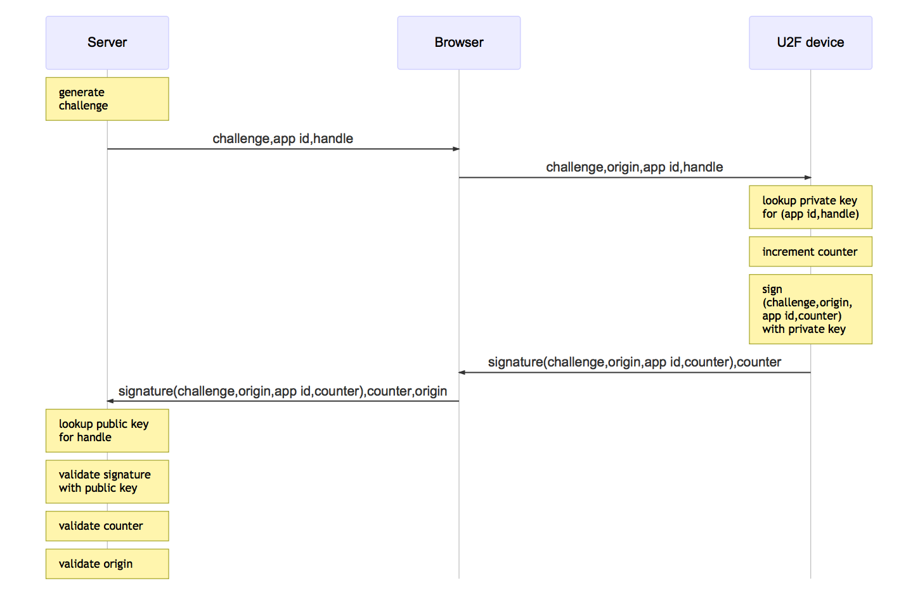

^Here we add a counter to the device. Each time the device is asked to sign something, it increments the counter and includes it in the signature

^The server stores the last counter value it saw

^When a signature arrives, the server compares the device counter with the stored one. If it isn't greater than the stored one, then we know that this is a cloned device, and we can take action

---

# [fit] Registration<br>flow


^That was the entire authentication process

^And now we know all the values the server and the device need to exchange during registration, so we can finally look at that

---

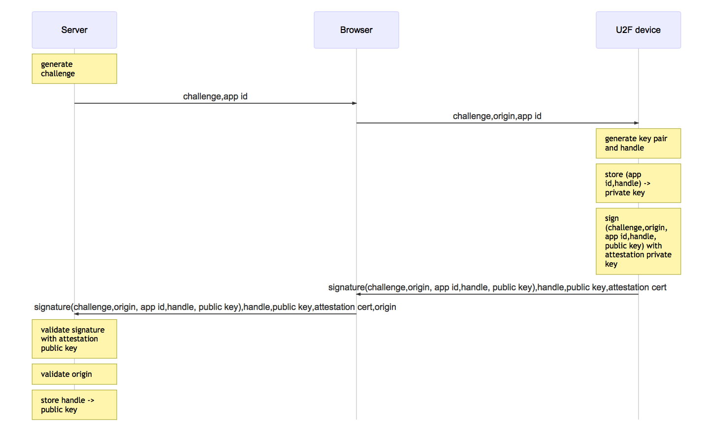

^Send a challenge and the app id as usual

^Browser adds the origin

^The device generates a keypair and handle,then stores the private key with the app id and handle for lookup later during auth. Then it signs the challenge with the attestation cert and returns it with the public key and handle.

^The server validates the signature and origin as normal and if it all checks out, stores the handle and public key with the user

---

# [fit] Attestation<br>certificate


^I mentioned something called an "attestation certificate" just then.

^Its a certificate shared by all devices of a particular model or production batch. Its used to identify the device

^The registration challenge is signed with its private key, and its returned to the server with the signature

---

```
Certificate:
    Data:
        Version: 3 (0x2)
        Serial Number: 776137165 (0x2e42e9cd)
        Signature Algorithm: sha256WithRSAEncryption
        Issuer: CN=Yubico U2F Root CA Serial 457200631
        Validity
            Not Before: Aug  1 00:00:00 2014 GMT
            Not After : Sep  4 00:00:00 2050 GMT
        Subject: CN=Yubico U2F EE Serial 776137165
        Subject Public Key Info:
            Public Key Algorithm: id-ecPublicKey
            EC Public Key:
                pub:
                    04:49:ba:3d:d4:9c:3b:a1:5b:d5:b8:75:8d:ef:db:
                    49:2e:2a:8c:3e:3f:70:02:c4:4d:5d:d4:83:3f:9f:
                    c0:ce:40:9d:91:37:4a:f0:51:7a:f2:00:6a:ba:39:
                    c2:fb:73:1b:36:71:a0:ce:5c:e9:da:c1:84:b5:61:
                    95:b9:70:cd:4c
                ASN1 OID: prime256v1
```

^This is a dump of part of the certificate from a Yubikey Plus

^Its a very boring X509 cert, there's nothing special about it

^You can use it to positively identify the device model

^Useful if you want to restrict access by device characteristics. For example, you could order a custom batch of devices which would all share a single certificate. You give those to your staff and make it so admin functions are only available to sessions that authenticated with one of those devices

---

# [fit] Implementation<br>details


^So that's all the internals, which you mostly don't have to care about

^What you do want to know is how to actually implement this

---

# Serverland

* Perl, Ruby, Python, PHP, Java, C#, C, Go, Javascript...
* Provide three main functions
 * Generate a challenge
 * Verify a registration response
 * Verify an authentication response

^★ There's server libraries for all the normal languages

^★ They all do roughly the same thing - create challenges and verify the two different kinds of responses

---

# Browserland

* Javascript

* Browser support
 * Chromium-based browsers (Chrome, Opera) via `u2f-api.js`
 * Firefox via extension (native Real Soon Now™)
 * ...

* Mobile
 * Android + Chrome + Google Authenticator + NFC

^★ You're gonna need Javascript. There's no way around that; you have to tell the browser to send stuff down to the U2F device, and take action when the response comes back. But its not a lot of Javascript; you can do it in a few lines.

^★ Browser support is good, but not great. Anything Chrome-ish should work fine. Firefox are working on native support, but there's a good extension available.

^Microsoft have said they're looking at it for Edge, but haven't committed. Apple remain silent, as usual.

^★ On mobile, it works on Android if you use Chrome, and you have Google's Authenticator app, and you have an NFC-based device like a Yubikey Neo. I haven't seen or heard anything about any other combinations working

---

# Browserland

```javascript
u2f.register(location.origin, // appId
             [{ challenge: '...', version: 'U2F_V2' }],
             [],
             function (r) {
               if (r.errorCode) {
                 alert("something bad happened: "+r.errorCode);
                 return;
               }
               // send r.registrationData and r.clientData
               // to server via XHR, form POST, etc
             }
            );
```

^This is how simple a registration request can be. Pass down the app id and challenge, and then in the callback, send the results back to the server

^I don't usually write Javascript, so please forgive me if this is actually garbage. At least I put in error checks

---

# Browserland

```javascript
u2f.sign(location.origin, // appId
         [{ challenge: '...', version: 'U2F_V2' }],
         [{ keyHandle: '...', version: 'U2F_V2' }],
         function (r) {
           if (r.errorCode) {
             alert("something bad happened: "+r.errorCode);
             return;
           }
           // send r.keyHandle, r.signatureData and r.clientData
           // to server via XHR, form POST, etc
         }
        );
```

^And signing is very similar. We add the key handle, that's all

^Your own code will be much smarter than this. I just wanted to show you that its not hard

---

# [fit] Browserless


^Here's a cool thing - you might not need a browser

^U2F devices are generic USB HID class devices

^So anything on the desktop can use them, not just the browser

---

# `libu2f-host`

^For that, you want libu2f-host

^It's a C library that implements the host and USB side of things

---

# `pam-u2f`

^I only know of one thing doing this - pam-u2f

^It plugs into the Unix authentication stack, so you can do things like unlock your laptop with your U2F device

---

# Bonus prize round!

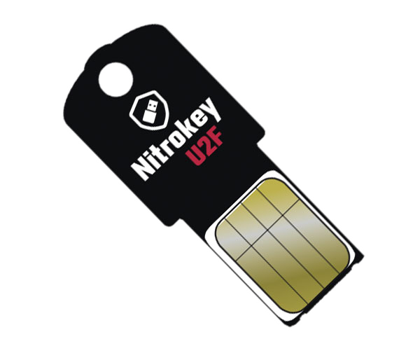

^So at this point some of you might be thinking that you'd like to try this out but you have to go and buy a thing and that's a bunch of hassle

^I've got you covered

^This is a Nitrokey U2F device. It comes on a little card. You punch it out and fold the tab over to make the USB bit thick enough to plug in. There's a little dab of glue on the back to hold it all together

^I've got 50 of these to give away

^Use it to secure your FastMail, Github, Dropbox, Google, etc account

^Or use it to learn how to add support to your service or app

^One condition: you have to tweet, blog or otherwise say something public about what you did. We're trying to make it more visible

^Come and find me later to get one and lets talk about it

---

# U 2 can U2F!


^So that's it! Now you know how to add usable and secure two-factor auth to your app

---

# U 2 can U2F!


* U2F is an open standard
* Secure
* Easy to use
* Lots of hardware to choose from, or build your own
* Simple to implement

^★ U2F is an open standard

^★ It's secure

^★ It's easy for users to use

^★ Lots of cheap hardware available, or you can build your own

^★ And its easy to implement

---

# Questions?


